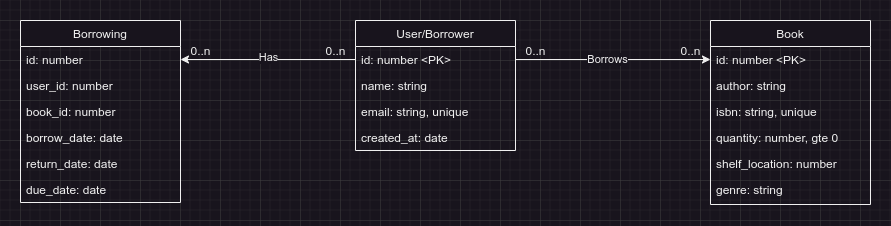

# Library Management System

This is a simple API created to manage a library system.

~~The API is documented using swagger.~~
I am going to use postman docs to share the api docs as I found swagger is pain to setup and make it auto register routes (I still may add this!)

## The Database

### Desgin Considerations
- The `id` for each table is consider a PK and reflects with the requirements as : `book_id`, `borrower_id`, `borrowing_id`
- The `Borrower/User` can borrow 0 or more books, but one book must have at least one borrower.
- 2 `Borrowers` can't borrow the same book `<Book.id>`
- Shelf location is string indicating the location is the library, asuming number of locations aren't that big.
- The quantity of books `quantity_available` is greater than or equal to zero, and `borrowers` can't borrow if book isn't available.
- Borrowing Table is Junction table, made after normalizating the database, used to capture the relationship between the Borrower and Book tables in a many-to-many relationship.

### Choosing the database
Both MySQL and PostgreSQL are excellent choices and meet the projects' requirements, but as a personal taste I will go with PostgreSQL as it's easier to setup for me and it supports out-of-the-box feaures like various data types.

### Database Migrations
Database migrations are one important aspect when building scalable system, it allows automated deployments, rollbacks, versioning and team collabs.
All the migrations are in `database/migrations/sql`

## Getting started
You don't need anything to start, just run `docker-compose up -d --build` and you're ready to kick!

<b>Running on development:</b>
- Use `docker-compose.dev.yml` : `docker-compose -f docker-compose.dev.yml up -d --build && docker-compose -f docker-compose.dev.yml logs -f`

<b>Running on production:</b>
- Use `docker-compose.prod.yml` : `docker-compose -f docker-compose.prod.yml up -d --build`

## Non-functional Requirements

1. Performance: The system should be optimized for reading operations since searching
and listing books/borrowers will be frequent operations.
2. Scalability: The system design should support the addition of new features in the future,
like reservations or reviews.
3. Security: Ensure that user inputs are validated to prevent SQL injection or other potential
security threats.

## Functional Requirements

1- Books:
- Add a book with details like title, author, ISBN, available quantity, and shelf location.
- Update a book’s details.
- Delete a book.
- List all books.
- Search for a book by title, author, or ISBN.

2- Borrowers:
- Register a borrower with details like name, email, and registered date (Keep the user
details as simple as possible).
- Update borrower’s details.
- Delete a borrower.
- List all borrowers.

3- Borrowing Process:
- A borrower can check out a book. The system should keep track of which books are
checked out and by whom.
- A borrower can return a book.
- A borrower can check the books they currently have.
- The system should keep track of due dates for the books and list books that are
overdue.

## Todo
- [X] Desgin an archicture to follow
- [X] Database
    - [X] Choose a database and why ?
    - [X] Schema Desgin
    - [X] Normalization
    - [X] Choosing indexes
- [X] API Desgin: REST
    - [X] Book routes
    - [ ] Borrower routes
- [X] Define a way to handle errors
- [ ] Security : Authorization and Authentication
- [ ] Documentations
- [ ] Production Setup: HTTPs, Docker
- [ ] Define a way to handle errors
- [ ] Testing
- [ ] Use absoulte paths in TS
