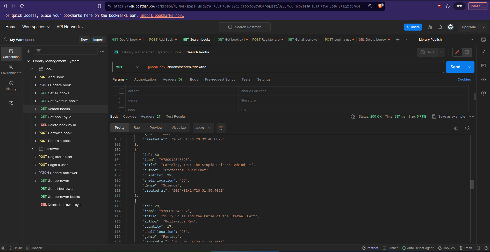

# Library Management System

Simple API created to manage your library.

## Contents
- [Overview](#overview)
    - [Non-Functional Requirements](#non-functional-requirements)
    - [Functional Requirements](#functional-requirements)
- [The Database](#the-database)
    - [Design Considerations](#design-considerations)
    - [Choosing The Database](#choosing-the-database)
    - [Database Migrations](#database-migrations)
- [Getting Started](#getting-started)
- [Features](#features)
- [Takes on Design](#takes-on-design)
- [Notes](#notes)

## Overview

## Non-functional Requirements

1. Performance: The system should be optimized for reading operations since searching
and listing books/borrowers will be frequent operations.
2. Scalability: The system design should support the addition of new features in the future,
like reservations or reviews.
3. Security: Ensure that user inputs are validated to prevent SQL injection or other potential
security threats.

## Functional Requirements

1- Books:
- Add a book with details like title, author, ISBN, available quantity, and shelf location.
- Update a book’s details.
- Delete a book.
- List all books.
- Search for a book by title, author, or ISBN.

2- Borrowers:
- Register a borrower with details like name, email, and registered date (Keep the user
details as simple as possible).
- Update borrower’s details.
- Delete a borrower.
- List all borrowers.

3- Borrowing Process:
- A borrower can check out a book. The system should keep track of which books are
checked out and by whom.
- A borrower can return a book.
- A borrower can check the books they currently have.
- The system should keep track of due dates for the books and list books that are
overdue.

## The Database

### Design Considerations
- The `id` for each table is consider a PK and reflects with the requirements as : `book_id`, `borrower_id`, `borrowing_id`
- The `Borrower/User` can borrow 0 or more books, but one book must have at least one borrower.
- 2 `Borrowers` can't borrow the same book `<Book.id>`
- Shelf location is string indicating the location is the library, asuming number of locations aren't that big.
- The quantity of books `quantity` is greater than or equal to zero, and `borrowers` can't borrow if book isn't exist nor available.
- Borrowing Table is Junction table, made after normalizating the database, used to capture the relationship between the Borrower and Book tables in a many-to-many relationship.

### Choosing the database
Both MySQL and PostgreSQL are excellent choices and meet the projects' requirements, but as a personal taste I will go with PostgreSQL as it's easier to setup for me and it supports out-of-the-box feaures like various data types.

### Database Migrations
Database migrations are one important aspect when building scalable system, it allows automated deployments, rollbacks, versioning and team collabs.
All the migrations are in `database/migrations/sql`

## Getting started
You don't need anything to start, just `docker-compose` and you're ready to kick!

<b>Running on development:</b>
- Use `docker-compose.dev.yml` : `docker-compose -f docker-compose.dev.yml up -d --build && docker-compose -f docker-compose.dev.yml logs -f`

<b>Running on production:</b>
- Use `docker-compose.prod.yml` : `docker-compose -f docker-compose.prod.yml --env-file .prod.env up -d --build`

If you have postman installed, or you have an account, you can test it out : [here](https://documenter.getpostman.com/view/20745767/2s9YsNeWEQ)

## Features
While the project is pretty simple and it just meets the requirements, it's worth mentioning that is has some cool features beside the already defined ones in the requirements:
- All CRUD operations are satisfied in a clean way
- API has simple rate limitation an caching on GET routes
- Database has indexes on most requested data as the system is mainly read heavy
- It's dockerized and can be setuped in one command

## Takes on Design
I have some takes on the design I came up with but for sake of limited time and loosy requirements. Following the requirements (bare minimal) forces me to make some weird routes:
- How the system works, for now: there is no super user and normal user (Admin: add/delete books and manage other users), (Normal user: borrow and return books).
- Borrow a book: `/api/v1/books/borrow`! as you can see it's on the books side which makes sense to me as it's more natural (book can be borrowed) same as Return!.
- Paginations are implemented for some routes but not all, based on a quick estimation of how many records can be queried on a route, take this: User can see the books they borrowed (no need to add paginations, I guess)
- Show borrowed books: `/api/v1/borrowers/<user_id>/books`, can you see it ?
- Search for books: `/api/v1/books/search?title=the&author=charles%dickens&genre=literature&isbn=978&limit=10&page=2` combining params - will get all the books which have "the" in the title by Charles Dickens on genre: Literature and so on.
- Getting overdue books: wellll is it better to keep it separate from the `/books` ?
- Usually updating email isn't realistic!

## Notes
- Currently, I am throwing database errors as server errors : `500`
- `npm run dev` won't work as the database is running in the container, run : `docker-compose -f docker-compose.dev.yml up -d --build && docker-compose -f docker-compose.dev.yml logs -f` instead.
- There are some unhandled cases like what happens when the user returns a book that has been deleted
- I know that throwing errors are expensive and should be used a lot specially in JS world

## Todo
- [X] Desgin an archicture to follow
- [X] Database
    - [X] Choose a database and why ?
    - [X] Schema Desgin
    - [X] Normalization
    - [X] Choosing indexes
- [X] API Desgin: REST
    - [X] Book routes
    - [X] Borrower routes
- [X] Security : Authorization and Authentication
- [X] Documentations
- [X] Production Setup: HTTPs, Docker
- [X] Define a way to handle errors : throw the errors from the service with status codes and check types on controller
- [ ] Testing
- [ ] Use absoulte paths in TS
- [ ] separate server errors from db errors
